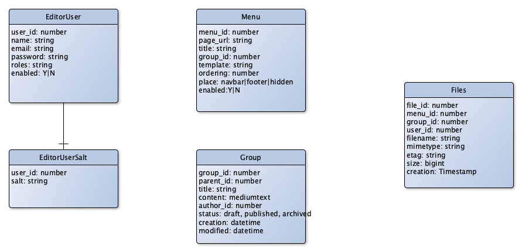

# Database Schema

> The MySql database scheme

## Overview

## Table `editor_users`

The table contains the users for the **Paper Editor** application

Field                   | Type           | Required | Description
------------------------|----------------|----------|----------------------
`user_id`               | number         | auto inc | The primary key for every user
`name`                  | varchar(60)    | not null | The user name
`email`                 | varchar(120)   | unique   | The user email address. It is unique
`password`              | varchar(240)   | not null | The user password
`roles`                 | varchar(240)   | not null | The roles as json string array
`enabled`               | 'Y', 'N'       | Y        | The flag if the user is enabled or disabled

## Table `editor_user_salts`

The table contains the salt for the user

Field                   | Type           | Required | Description
------------------------|----------------|----------|----------------------
`user_id`               | number         | not null | The foreign key for the user
`salt`                  | varchar(240)   | not null | The salt for the user password

## Table `menu`

The table contains the menu structure.

Field                   | Type           | Required | Description
------------------------|----------------|----------|----------------------
`menu_id`               | number         | auto inc | The primary key of the menu item
`page_url`              | varchar(512)   | unique   | The page url to the content. It is unique together with `place`
`title`                 | varchar(120)   | not null | The menu title
`group_id`              | number         | not null | The id of the group content
`template`              | varchar(30)    | not null | The name of the template for the group content
`ordering`              | number         | 0        | The ordering number for the menu list
`place`                 | enum           | `navbar` | The place of the menu item `navbar`, `footer`, `hidden`
`enabled`               | 'Y', 'N'       | `Y`      | The flag for menu item is enabled or disabled

## Table `files`

The table contains the meta information about the files

Field                   | Type           | Required | Description
------------------------|----------------|----------|----------------------
`file_id`               | number         | auto inc | The primary key for the file information
`menu_id`               | number         | not null | The foreign key to the menu. The file is assigned to this menu
`group_id`              | number         | not null | The foreign key to the group content. The file is assgend to this group
`user_id`               | number         | not null | The user is the uploader of the is file
`filename`              | varchar(255)   | not null | The name of the file
`mimetype`              | varchar(60)    | not null | The mime type of the file
`etag`                  | varchar(120)   | not null | The etag for the response of the file (It is the postfix)
`size`                  | bigint         | not null | The size of the file
`creation`              | timestamp      | not null | The timestamp of the uploading

## Table `groups`

The table contains the content from menu items as page- or blog content

Field                   | Type           | Required | Description
------------------------|----------------|----------|----------------------
`group_id`              | number         | auto inc | The primary key of the group content
`parent_id`             | number         | null     | The parent group id. In case of blog, this is an article
`title`                 | varchar(120)   | not null | The title of the content
`content`               | mediumtext     | not null | The content body
`author_id`             | number         | not null | The author of the content
`status`                | enum           | `draft`  | The status of the content. `draft`, `published`, `archived`
`creation`              | datetime       | not null | The datetime of creation
`modified`              | datetime       | not null | The modified datetime
